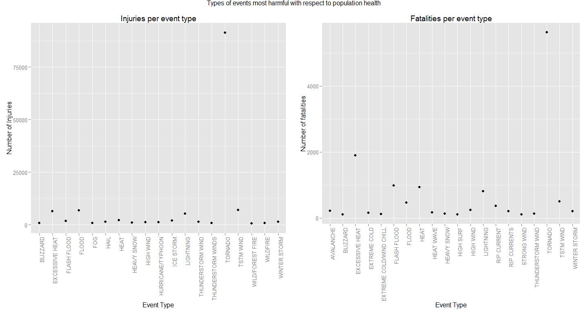
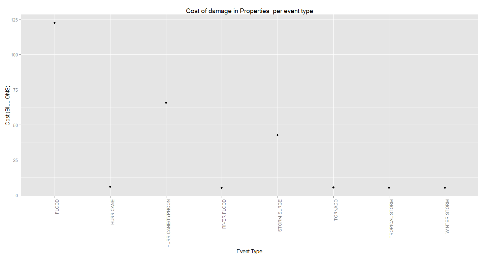

# Damage in properties and issues with respect to population health caused by severe weather events
Francisco J. Garcia R.  
Tuesday, August 19, 2014  

##Synopsis 

The goal of this report is show the most harmful events that can be affect the united states, in order to take some decisions related to the future investments in planning and management of damages.

Storms and other severe weather events can cause both public health and economic problems for communities and municipalities. Many severe events can result in fatalities, injuries, and property damage, and preventing such outcomes to the extent possible is a key concern.

This project involves exploring the U.S. National Oceanic and Atmospheric Administration's (NOAA) storm database.

This database tracks characteristics of major storms and weather events in the United States, including when and where they occur, as well as estimates of any fatalities, injuries, and property damage.

I selected and I filtered some variables that form the dataset, in order to explain the next questions:
- Across the United States, which types of events are most harmful with respect to population health?
- Across the United States, which types of events have the greatest economic consequences?

In the present report, I explain the codebook and code file that I developed in order to complete and show the correct answers.

The project was developed using Rstudio and some toolbox that it improved the analysis process. You can find more details of the assessment in the readme file.

##Data Processing

### Initial configuration

The goal of this section is create some variables that will be used for processing data


```r
#Variables
urlData <- "https://d396qusza40orc.cloudfront.net/repdata%2Fdata%2FStormData.csv.bz2"
DataFile_bz2 <- "repdata_data_StormData.csv.bz2"
DataFileCsv <- "repdata_data_StormData.csv"

#Pre-requisites:
IsRutilsInstalled <- require("R.utils")
if(!IsRutilsInstalled){
    install.packages("R.utils")
    library(R.utils)
    }

IsGridInstalled <- require("grid")
```

```
## Loading required package: grid
```

```r
if(!IsGridInstalled){
    install.packages("grid")
    library("grid")
    }

IsGridExtraInstalled <- require("gridExtra")
```

```
## Loading required package: gridExtra
```

```
## Warning: package 'gridExtra' was built under R version 3.1.1
```

```r
if(!require("gridExtra")){
    install.packages("gridExtra")
    library("gridExtra")
    }

library(ggplot2)
```

### Getting data

This process was developed through of the next steps:
1. Download compressed file
2. Extract file
3. Load data into the variable: `OriginalData`


```r
GettingData <- function(){
    #Download compressed file
    if(!file.exists(DataFile_bz2)){
        download.file(urlData, DataFile_bz2)
        }
    
    #extract CSV data
    if(!file.exists(DataFileCsv)){
        bunzip2(DataFile_bz2, destname=DataFileCsv, overwrite=TRUE, remove=TRUE)
        }
    
    #Read Data
    if(file.exists(DataFileCsv)){
        OriginalData <- read.csv(DataFileCsv)
        OriginalData
        }else{
             NULL
            }
    }

OriginalData <- GettingData();
```

### cleaning and processing data
In order to clean the input data, I selected and I filtered the next variables:

- `dataGroupByEventTypeInjuries` Represent the total injuries caused by each type of event
- `graphInjuries` Graph that explain the most harmful type of event with respect to population health, the graph filter the `dataGroupByEventTypeInjuries` > 500
- `dataGroupByEventTypeFatalities` Represent the total fatalities per type of event
- `graphFatalities` Graph that explain the most harmful type of event with respect to population health, the graph filter the `dataGroupByEventTypeFatalities` > 100
- `dataGroupByEventTypePROPDMG` Represent the Cost of damage in Properties caused by each type of event
- `graphDamage` Graph that explain the Cost of damage in Properties caused by each type of event, the graph filter the `PROPDMGEXP` = "B" and Cost > 4 Billions


```r
#Total INJURIES
dataGroupByEventTypeInjuries <- aggregate(OriginalData$INJURIES, 
                            list(EVTYPE = OriginalData$EVTYPE), 
                            sum,
                            na.action =FALSE )

#Clear the NA's values
dataGroupByEventTypeInjuries <- dataGroupByEventTypeInjuries[complete.cases(dataGroupByEventTypeInjuries),]

#Filter the type of event which  500  facts or more
dataGroupByEventTypeInjuries <- dataGroupByEventTypeInjuries[which(dataGroupByEventTypeInjuries$x>500),]

#Load the chart of injuries
graphInjuries <- qplot(x = EVTYPE,y =  x, data=dataGroupByEventTypeInjuries)  + 
    theme(axis.text.x = element_text(angle = 90, hjust = 1)) + 
    xlab("Event Type") +
    ylab("Number of Injuries") +
    ggtitle("Injuries per event type")

#Total FATALITIES
dataGroupByEventTypeFatalities <- aggregate(OriginalData$FATALITIES, 
                            list(EVTYPE = OriginalData$EVTYPE), 
                            sum,
                            na.action =FALSE )
#Clear the NA's values
dataGroupByEventTypeFatalities <- dataGroupByEventTypeFatalities[complete.cases(dataGroupByEventTypeFatalities),]

#Filter the type of event which  100  facts or more
dataGroupByEventTypeFatalities <- dataGroupByEventTypeFatalities[which(dataGroupByEventTypeFatalities$x>100),]

#Load the chart of fatalities
graphFatalities <- qplot(x = EVTYPE,y =  x, data=dataGroupByEventTypeFatalities)  + 
    theme(axis.text.x = element_text(angle = 90, hjust = 1)) + 
    xlab("Event Type") +
    ylab("Number of fatalities") +
    ggtitle("Fatalities per event type")


#Cost of damage in Properties:
dataGroupByEventTypePROPDMG <- aggregate(OriginalData$PROPDMG, 
                            list(EVTYPE = OriginalData$EVTYPE, PROPDMGEXP = OriginalData$PROPDMGEXP), 
                            sum,
                            na.action =FALSE )

#Clear the NA's values
dataGroupByEventTypePROPDMG <- dataGroupByEventTypePROPDMG[complete.cases(dataGroupByEventTypePROPDMG),]

#Filter the type of event which PROPDMGEXP="B" (BILLIONS)
dataGroupByEventTypePROPDMG <- dataGroupByEventTypePROPDMG[which(dataGroupByEventTypePROPDMG$PROPDMGEXP=="B") ,]

#Filter the type of event whichcost > 4 (BILLIONS)
dataGroupByEventTypePROPDMG <- dataGroupByEventTypePROPDMG[which(dataGroupByEventTypePROPDMG$x>4) ,]

#Load the chart of Cost of damage in Properties:
graphDamage <- qplot(x = EVTYPE,y =  x, data=dataGroupByEventTypePROPDMG)  + 
    theme(axis.text.x = element_text(angle = 90, hjust = 1)) + 
    xlab("Event Type") +
    ylab("Cost (BILLIONS)") +
    ggtitle("Cost of damage in Properties  per event type")
```

##Results 

The goal of this report is show the most harmful events that can be affect the united states, in order to take some decisions related to the future investments in planning and management of damages.

- Across the United States, which types of events (as indicated in the `EVTYPE` variable) are most harmful with respect to population health?

```r
#Plot both graphs into the same chart
grid.arrange(graphInjuries, 
             graphFatalities, 
             ncol = 2, 
             main = "Types of events most harmful with respect to population health")
```

 
**Answer:** The most harmful type of event for the population health is the **Tornado**, because it caused the most amount of *injuries and fatalities* in the United states.

- Across the United States, which types of events have the greatest economic consequences?

```r
#Plot the chart previously generated
summary(dataGroupByEventTypePROPDMG)
```

```
##                EVTYPE    PROPDMGEXP       x         
##  FLOOD            :1   B      :8    Min.   :  5.00  
##  HURRICANE        :1          :0    1st Qu.:  5.11  
##  HURRICANE/TYPHOON:1   -      :0    Median :  5.50  
##  RIVER FLOOD      :1   ?      :0    Mean   : 32.09  
##  STORM SURGE      :1   +      :0    3rd Qu.: 48.30  
##  TORNADO          :1   0      :0    Max.   :122.50  
##  (Other)          :2   (Other):0
```

```r
graphDamage
```

 
**Answer:** the greatest economic consequences caused by type of event is the **Floods**, because it caused the most amount of  damages in properties in the United states.

##Aditional info
For debugging purposes, the specification of the machine:

```r
sessionInfo()
```

```
## R version 3.1.0 (2014-04-10)
## Platform: x86_64-w64-mingw32/x64 (64-bit)
## 
## locale:
## [1] LC_COLLATE=Spanish_Colombia.1252  LC_CTYPE=Spanish_Colombia.1252   
## [3] LC_MONETARY=Spanish_Colombia.1252 LC_NUMERIC=C                     
## [5] LC_TIME=Spanish_Colombia.1252    
## 
## attached base packages:
## [1] grid      stats     graphics  grDevices utils     datasets  methods  
## [8] base     
## 
## other attached packages:
## [1] ggplot2_1.0.0     gridExtra_0.9.1   R.utils_1.32.4    R.oo_1.18.0      
## [5] R.methodsS3_1.6.1
## 
## loaded via a namespace (and not attached):
##  [1] colorspace_1.2-4 digest_0.6.4     evaluate_0.5.5   formatR_0.10    
##  [5] gtable_0.1.2     htmltools_0.2.4  knitr_1.6        labeling_0.2    
##  [9] MASS_7.3-31      munsell_0.4.2    plyr_1.8.1       proto_0.3-10    
## [13] Rcpp_0.11.2      reshape2_1.4     rmarkdown_0.2.49 scales_0.2.4    
## [17] stringr_0.6.2    tools_3.1.0      yaml_2.1.13
```

